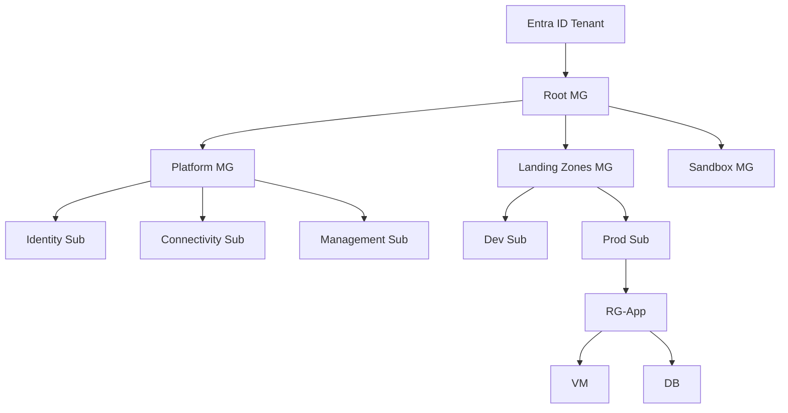

# 🌐 **Azure Subscriptions & Governance — Enterprise Complete Guide**

---

## **1️⃣ Azure Subscription — Deep Theory**

### **📘 Definition (Architect View)**

An **Azure Subscription** is a **logical isolation boundary** that simultaneously defines:

1. **Financial boundary** (billing, invoices, budgets)
2. **Security boundary** (RBAC + policies)
3. **Quota boundary** (CPU cores, VNets, IPs)
4. **Operational boundary** (blast-radius containment)

> 🔑 **Key Insight:**
> Subscriptions are **not** an identity boundary (that’s Entra ID).
> They are **control + cost + limit boundaries**.

---

### **🧠 Subscription vs Resource Group (Exam Favorite)**

| Feature      | Subscription | Resource Group |
| ------------ | ------------ | -------------- |
| Billing      | ✅ Yes        | ❌ No           |
| Quotas       | ✅ Yes        | ❌ No           |
| RBAC Scope   | ✅ Yes        | ✅ Yes          |
| Policy Scope | ✅ Yes        | ✅ Yes          |
| Can contain  | RGs          | Resources      |
| Lifecycle    | Long-term    | Short/Medium   |

---

### **📌 When to Create a New Subscription**

| Scenario             | New Subscription? | Why                   |
| -------------------- | ----------------- | --------------------- |
| Prod vs Dev          | ✅ Yes             | Risk & cost isolation |
| Separate BU          | ✅ Yes             | Chargeback            |
| Same app, same env   | ❌ No              | Use RG                |
| Regulatory workloads | ✅ Yes             | Compliance boundary   |
| Sandbox users        | ✅ Yes             | Prevent blast radius  |

---

## **2️⃣ Azure Management Hierarchy — Governance Backbone**

### **🔺 Hierarchy Model**

```
Entra ID Tenant
   └── Management Groups
        └── Subscriptions
             └── Resource Groups
                  └── Resources
```

### **Why Management Groups Exist**

Without MGs → **No governance at scale**

| Capability           | Without MG | With MG |
| -------------------- | ---------- | ------- |
| Policy at scale      | ❌          | ✅       |
| RBAC at scale        | ❌          | ✅       |
| Enterprise standards | ❌          | ✅       |
| Landing zones        | ❌          | ✅       |

---

### **🧩 Recommended Enterprise MG Structure**

| MG Name            | Purpose         |
| ------------------ | --------------- |
| **Platform**       | Shared services |
| **LandingZones**   | App workloads   |
| **Sandbox**        | Experiments     |
| **Decommissioned** | Locked subs     |

---

## **3️⃣ Azure RBAC — Access Governance (Deep Dive)**

### **🔐 RBAC Evaluation Logic**

```
Effective Access =
Σ (Role Assignments)
− Deny Assignments
```

### **RBAC Scope Levels**

| Scope            | Typical Use        |
| ---------------- | ------------------ |
| Management Group | Platform admins    |
| Subscription     | Environment admins |
| Resource Group   | App teams          |
| Resource         | Rare / exception   |

---

### **🧪 Custom Role Example (JSON)**

```json
{
  "Name": "VM Operator",
  "Description": "Start/Stop VMs only",
  "Actions": [
    "Microsoft.Compute/virtualMachines/start/action",
    "Microsoft.Compute/virtualMachines/deallocate/action",
    "Microsoft.Compute/virtualMachines/read"
  ],
  "AssignableScopes": [
    "/subscriptions/<SUB-ID>"
  ]
}
```

---

## **4️⃣ Azure Policy — Compliance Engine (Critical Section)**

### **📘 Policy Components**

| Component  | Description      |
| ---------- | ---------------- |
| Definition | Rule logic       |
| Initiative | Policy set       |
| Assignment | Scope binding    |
| Effect     | Enforce behavior |

---

### **🎯 Policy Effects Explained**

| Effect            | Meaning          |
| ----------------- | ---------------- |
| Deny              | Block deployment |
| Audit             | Report only      |
| AuditIfNotExists  | Soft compliance  |
| DeployIfNotExists | Auto-fix         |
| Modify            | Change request   |

---

### **🧪 Policy Example — Enforce Tags**

```json
{
  "if": {
    "field": "tags['Owner']",
    "exists": "false"
  },
  "then": {
    "effect": "deny"
  }
}
```

---

### **🧪 Policy — Allowed Regions**

```json
{
  "if": {
    "not": {
      "field": "location",
      "in": ["centralindia", "southindia"]
    }
  },
  "then": {
    "effect": "deny"
  }
}
```

---

## **5️⃣ Azure Landing Zones — Enterprise Standard**

### **📦 What a Landing Zone Includes**

| Area       | What It Covers     |
| ---------- | ------------------ |
| Identity   | Entra ID, RBAC     |
| Network    | Hub-Spoke          |
| Security   | Policies, Defender |
| Monitoring | Log Analytics      |
| Automation | IaC                |
| Governance | MGs + Policies     |

---

### **🧭 Platform Subscriptions**

| Subscription | Responsibility    |
| ------------ | ----------------- |
| Identity     | AD DS, Entra      |
| Connectivity | VPN, ExpressRoute |
| Management   | Logs, Backup      |

---

## **6️⃣ Cost Governance — FinOps Model**

### **💰 Cost Control Pillars**

| Pillar         | Tool          |
| -------------- | ------------- |
| Visibility     | Cost Analysis |
| Accountability | Tags          |
| Optimization   | Advisor       |
| Control        | Budgets       |

---

### **🧪 Budget with Alert (CLI)**

```bash
az consumption budget create \
  --amount 10000 \
  --time-grain Monthly \
  --name ProdBudget \
  --category Cost
```

---

## **7️⃣ Resource Graph — Cross-Subscription Queries**

### **🧪 Find All Unused Public IPs**

```kusto
Resources
| where type == "microsoft.network/publicipaddresses"
| where properties.ipAddress == ""
```

---

### **🧪 VMs Without Backup**

```kusto
Resources
| where type == "microsoft.compute/virtualmachines"
| where isnull(properties.extended.instanceView)
```

---

## **8️⃣ Infrastructure as Code (Governance Ready)**

### **🧪 Bicep — Management Group**

```bicep
targetScope = 'managementGroup'

resource mg 'Microsoft.Management/managementGroups@2021-04-01' = {
  name: 'cloudnautic-landingzones'
}
```

---

### **🧪 Terraform — Policy Assignment**

```hcl
resource "azurerm_policy_assignment" "tags" {
  name                 = "enforce-tags"
  scope                = azurerm_management_group.root.id
  policy_definition_id = data.azurerm_policy_definition.tags.id
}
```

---

## **9️⃣ Real-World Use Cases**

### **Use Case 1: Startup (Low Governance)**

| Item          | Choice   |
| ------------- | -------- |
| MGs           | Optional |
| Subscriptions | 1–2      |
| Policy        | Audit    |
| RBAC          | Simple   |

---

### **Use Case 2: Enterprise (High Governance)**

| Item          | Choice          |
| ------------- | --------------- |
| MGs           | Mandatory       |
| Subscriptions | Per env         |
| Policy        | Deny            |
| RBAC          | Least privilege |
| IaC           | Mandatory       |

---

## **🔟 Interview-Ready Architecture Diagram**



---

## **🔟 Final Governance Decision Matrix**

| Question                | Answer         |
| ----------------------- | -------------- |
| Need billing isolation? | Subscription   |
| Need access control?    | RBAC           |
| Need compliance?        | Policy         |
| Need scale governance?  | MG             |
| Need standardization?   | Landing Zone   |
| Need visibility?        | Resource Graph |

---
