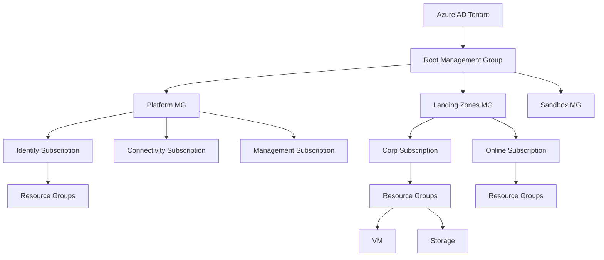

# **🌐 Azure Subscriptions & Governance — Complete Guide**


---

## **1️⃣ What is an Azure Subscription?**

An **Azure Subscription** is a logical container that groups Azure resources and defines:

* **Billing boundary** (costs are associated per subscription)
* **Resource access boundary**
* **Quota/limits boundary** (VM limits, IP addresses, VNets, etc.)
* **Governance boundary** using RBAC & Policies

### **Why Multiple Subscriptions?**

Organizations use multiple subscriptions for:

* Separation of **Prod / Dev / Test**
* Department-wise billing (IT, HR, Finance)
* Project-wise isolation
* Security and compliance boundaries
* Scaling to enterprise landing zones

---

## **2️⃣ Azure Subscription Hierarchy (Management Structure)**

### **🔺 Azure Management Hierarchy**

**Tenant → Management Groups → Subscriptions → Resource Groups → Resources**


### **🧩 Components**

| Level                       | Purpose                         | Example                              |
| --------------------------- | ------------------------------- | ------------------------------------ |
| **Tenant (AAD / Entra ID)** | Identity & security boundary    | Organization root                    |
| **Management Groups**       | Apply governance at scale       | Sandbox / Landing Zone / Prod Groups |
| **Subscriptions**           | Billing, quota, policy boundary | Dev-Sub1, Prod-Sub1                  |
| **Resource Groups**         | Logical grouping of resources   | RG-App1                              |
| **Resources**               | Actual Azure services           | VM, Storage, VNet                    |

---

## **3️⃣ Azure Governance – Key Components**

### **✔️ 1. Azure Management Groups**

Used to organize subscriptions.

**Use Cases:**

* Enforce policies across all subscriptions
* Apply RBAC for groups of subscriptions
* Enterprise landing zone hierarchy

---

### **✔️ 2. Azure RBAC (Role-Based Access Control)**

| Access Model       | Description                                    |
| ------------------ | ---------------------------------------------- |
| **IAM / RBAC**     | Fine-grained access control to Azure resources |
| **Built-In Roles** | Reader, Contributor, Owner, User Access Admin  |
| **Custom Roles**   | Tailored permissions                           |

**RBAC Scope Levels**

* Management Group
* Subscription
* Resource Group
* Resource

---

### **✔️ 3. Azure Policy**

Controls what users **can and cannot deploy**.

Examples:

* Enforce VMs only in a specific region
* Enforce tagging (CostCenter, Owner)
* Block Public IP on VM
* Enforce HTTPS on App Services

Azure Policy is core to **Governance, Security, Compliance**.

---

### **✔️ 4. Azure Blueprints (Deprecated → use Landing Zones & Templates)**

Used to standardize deployments, now replaced by:

* **Bicep**
* **ARM templates**
* **Terraform Landing Zones**
* **Azure Landing Zone Accelerator**

---

### **✔️ 5. Azure Resource Graph (ARG)**

Query resources across subscriptions.

Example:

```kusto
Resources
| where type contains "Microsoft.Compute/virtualMachines"
```

---

### **✔️ 6. Cost Management & Billing**

Provides:

* Cost analysis
* Budgets & alerts
* Advisor recommendations
* Chargeback / showback

---

## **4️⃣ Azure Landing Zones (Enterprise Governance)**


Azure Landing Zone provides:

* Standardized subscription structure
* Security & policy baseline
* Identity & access guardrails
* Network topology (Hub-Spoke)
* Logging & monitoring
* Automation

### **Landing Zone Types**

* **Enterprise Scale Landing Zone (ESLZ)**
* **Terraform Azure Landing Zone (IAAC)**
* **CAF (Cloud Adoption Framework) Landing Zone**

---

## **5️⃣ Subscription Design Best Practices**

### **📌 1. Use Management Groups**

Typical hierarchy:

```
Root
│
├── Platform
│   ├── Identity
│   ├── Connectivity
│   └── Management
│
├── Landing Zones
│   ├── Corp
│   └── Online
│
└── Sandbox
```

---

### **📌 2. Enforce Policies from Top Level**

Examples:

* Allowed Locations = "Central India, South India"
* Enforce Tags = "Owner", "Environment", "Project"
* Disallow Public IP
* Enforce Azure Monitor Agent

---

### **📌 3. Separate Subscriptions**

| Environment      | Subscription    |
| ---------------- | --------------- |
| Dev              | Dev-Apps-01     |
| Test             | Test-Apps-01    |
| Production       | Prod-Apps-01    |
| Central Services | Platform-Shared |

---

### **📌 4. Use Naming Standards**

Example:

```
<dept>-<app>-<env>-<resource>
fin-payroll-prod-vm01
```

---

### **📌 5. Cost Management**

Implement:

* Budgets
* Alerts
* Tagging
* Resource cleanup automation

---

## **6️⃣ Azure Subscription Governance Tools Overview**

| Tool                          | Purpose                    |
| ----------------------------- | -------------------------- |
| **Azure Policy**              | Enforce compliance         |
| **Management Groups**         | Organize subscriptions     |
| **Azure Blueprints (legacy)** | Standard deployments       |
| **Cost Management**           | Budget, cost analysis      |
| **Azure Advisor**             | Best practices             |
| **Azure Monitor**             | Logs, metrics              |
| **Resource Graph**            | Query at scale             |
| **Tags**                      | Cost & management metadata |

---

## **7️⃣ CLI & PowerShell Commands**

### **Azure CLI**

Login:

```bash
az login
```

List subscriptions:

```bash
az account list --output table
```

Set subscription:

```bash
az account set --subscription "<SUB-ID>"
```

Create management group:

```bash
az account management-group create --name Cloudnautic-MG
```

Assign policy:

```bash
az policy assignment create --name "AllowedLocations" --policy "<policy-id>"
```

---

### **PowerShell**

```powershell
Connect-AzAccount
Get-AzSubscription
Set-AzContext -SubscriptionId "<SUB-ID>"
New-AzManagementGroup -GroupName "Cloudnautic-MG"
```

---

## **8️⃣ Governance Real-World Scenario (For DevOps / Architect Interviews)**

### **Scenario: Enterprise with 500+ Developers**

**Challenges:**

* Resource misuse
* No tagging
* Shadow IT deployments
* High cost

### **Governance Solution:**

1. Create **Management Groups**: Platform, LandingZones, Sandbox
2. Apply **Policies**:

   * Enforce tagging
   * Restrict region
   * Block Public IP
3. Create **Dedicated Subscriptions**:

   * Dev/Test/Prod
4. Implement **Azure Monitor + Log Analytics**
5. Enforce **RBAC** with least privilege
6. Set **Budgets & Alerts**

---

## **9️⃣ Architecture Diagram (Text-Based - You can convert to Mermaid)**



---

# **🔟 Summary Cheat Sheet (Perfect for Your Slides)**

| Topic                 | Key Points                          |
| --------------------- | ----------------------------------- |
| **Subscription**      | Billing + resource boundary         |
| **Management Groups** | Organize subscriptions + governance |
| **RBAC**              | Access management                   |
| **Azure Policy**      | Compliance enforcement              |
| **Landing Zones**     | Enterprise governance framework     |
| **Cost Management**   | Budgets & alerts                    |
| **Tags**              | Cost allocation                     |
| **Resource Graph**    | Query across subscriptions          |

---
